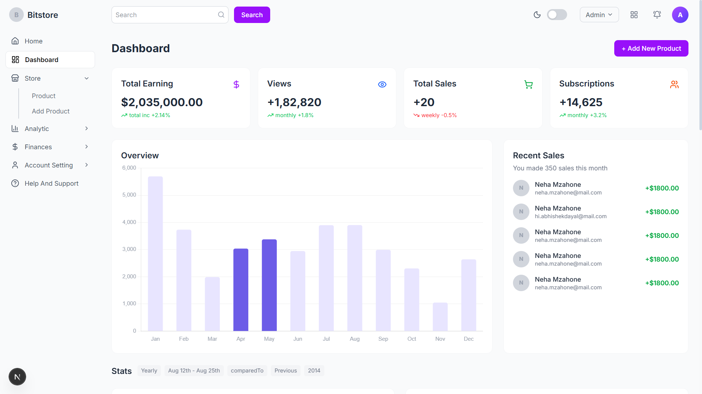
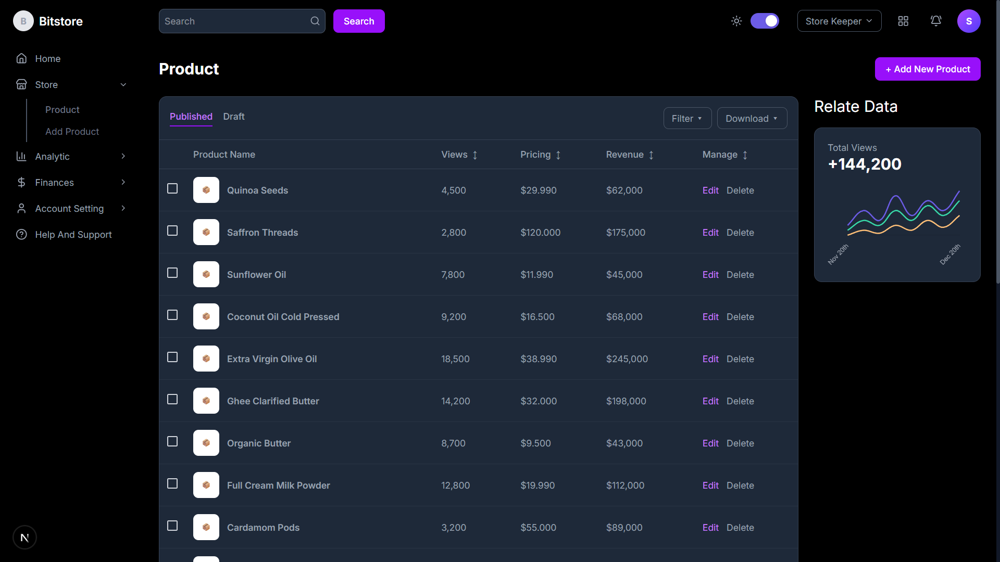

# 🛒 Commodities Management System

A full-stack **Commodities Management System** built with role-based access, dashboard analytics, product management, and light/dark mode theming.

---

## Tech Stack

| Layer      | Technology                                               |
|------------|----------------------------------------------------------|
| **Backend**  | NestJS · GraphQL (Code-First) · Prisma ORM · SQLite     |
| **Frontend** | Next.js 16 · TypeScript · Tailwind CSS v4 · Apollo Client |
| **Auth**     | JWT (Bearer tokens) · Passport.js · RBAC guards         |

---

## Project Structure

```
├── backend/                  NestJS + GraphQL API
│   ├── prisma/
│   │   ├── schema.prisma     Database schema
│   │   ├── seed.ts           Seed script (2 users, 5 categories, 20 products)
│   │   └── migrations/       Auto-generated migrations
│   └── src/
│       ├── auth/             Login, JWT, Guards, RBAC
│       ├── products/         CRUD, Pagination, Filtering
│       ├── dashboard/        Stats & Chart aggregation (Manager only)
│       ├── prisma/           PrismaService (global)
│       └── common/           Decorators, Enums, Guards
│
├── frontend/                 Next.js App
│   └── src/
│       ├── app/
│       │   ├── login/        Login page
│       │   └── (authenticated)/
│       │       ├── dashboard/    Dashboard (Manager only)
│       │       ├── products/     Product list + Add/Edit
│       │       └── layout.tsx    Auth guard wrapper
│       ├── components/layout/    Sidebar, Header, Footer
│       ├── lib/                  Apollo client, Auth & Theme contexts
│       └── graphql/              Queries & Mutations
│
└── README.md                 ← You are here
```

---

## Quick Start

### Prerequisites
- **Node.js** ≥ 18
- **npm** ≥ 9

### 1. Backend

```bash
cd backend
npm install

# Run migration + seed (creates SQLite DB with sample data)
npx prisma migrate dev --name init

# Start dev server (port 4000)
npm run start:dev
```

The GraphQL Playground is at **http://localhost:4000/graphql**.

### 2. Frontend

```bash
cd frontend
npm install

# Start dev server (port 3000)
npm run dev
```

Open **http://localhost:3000** in your browser.

---

## Demo Credentials

| Role           | Email               | Password       |
|----------------|---------------------|----------------|
| **Manager**     | manager@slooze.com  | password123    |
| **Store Keeper** | keeper@slooze.com   | password123    |

---

## Role-Based Access Rules

| Feature          | Manager | Store Keeper |
|------------------|---------|-------------|
| Login            | ✅       | ✅           |
| Dashboard        | ✅       | ❌           |
| View Products    | ✅       | ✅           |
| Add/Edit Products| ✅       | ✅           |
| Role-Based UI    | ✅       | ✅           |

- **Sidebar**: Dashboard menu item is hidden for Store Keepers
- **Route guards**: Attempting to access `/dashboard` as Store Keeper redirects to `/products`
- **Backend RBAC**: `dashboardStats` GraphQL query is guarded with `@Roles(MANAGER)`

---

## Features Implemented

### Authentication & Access
- Login page with email/password validation
- JWT-based auth with `Bearer` tokens stored in `localStorage`
- Role-based redirect: Managers → Dashboard, Store Keepers → Products

### Dashboard
- 4 stats cards (Total Earning, Views, Sales, Subscriptions) with trend indicators
- Overview bar chart, Recent Sales list
- Stats grid with bar + line charts
- Bottom row: Subscription Performers, Top Sales, Payment History
- **Manager-only** — guarded on both frontend and backend

### View Products
- Published / Draft tabs with filtering
- Sortable table with product name, views, pricing, revenue
- Pagination controls
- Sidebar chart showing Total Views
- Edit & Delete actions per row

### Add/Edit Products
- Form with: Product Name, Category dropdown, Description, Tags
- Pricing section: Price, Discount, Discount Category
- Image upload zones (Preview + Thumbnail) — UI ready
- Save / Discard Change buttons

### Light/Dark Mode
- Theme toggle in sidebar (Sun/Moon icon)
- Persisted to `localStorage`
- Applied via `.dark` class on `<html>` element
- Full dark mode support across all pages

### Role-Based Menu Restrictions
- Sidebar nav items filtered by user role
- Dashboard hidden for Store Keepers
- Route guard in authenticated layout redirects unauthorized users
- Backend `@Roles()` decorator + `RolesGuard` on GraphQL resolvers

---

## GraphQL API

### Mutations
| Mutation         | Auth     | Description              |
|------------------|----------|--------------------------|
| `login`          | Public   | Authenticate user        |
| `createProduct`  | JWT      | Create a new product     |
| `updateProduct`  | JWT      | Update existing product  |
| `deleteProduct`  | JWT      | Delete a product         |

### Queries
| Query             | Auth         | Description                    |
|-------------------|--------------|--------------------------------|
| `products`        | JWT          | Paginated, filtered products   |
| `product`         | JWT          | Single product by ID           |
| `categories`      | JWT          | All categories                 |
| `dashboardStats`  | JWT + MANAGER| Dashboard analytics data       |

---

## Sample Data

- **2 Users**: Manager + Store Keeper (bcrypt-hashed passwords)
- **5 Categories**: Grains, Beverages, Spices, Dairy, Oils
- **20 Products**: Realistic commodities with prices, views, revenue, and status (17 Published, 3 Draft)

---

## Assumptions

1. **No real image upload** — image upload zones are UI-only (drag-and-drop areas rendered but no file handling backend)
2. **SQLite by default** — for zero-config local development; Supabase SQL provided for cloud deployment
3. **JWT stored in localStorage** — suitable for demo; production would use httpOnly cookies
4. **Sample dashboard data** — charts use randomly generated + seeded data for demonstration
5. **Social login buttons** — UI only, not functional (Google/Facebook OAuth not configured)

---

## User Interface
- Dashboard (Manager)
  
  
  
- View Products (Store Keeper)

  
  
## License

MIT License - See LICENSE file for details
